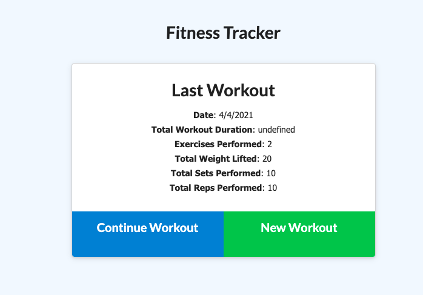
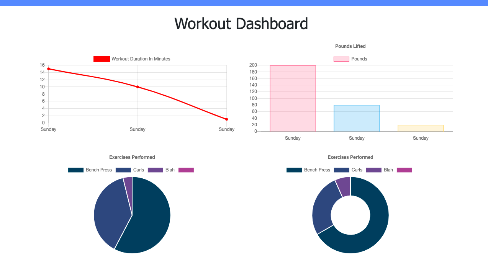

# fitness-tracker
I was able to achieve what was required. The data is presented on the screen, total weight and total duration are shown and you can add several workouts to the same workout session.

## Links

<a href="https://fitness-tracker-de.herokuapp.com/exercise?id=606a88a4f0d4d900151050a0">Heroku</a>
<a href="https://github.com/daveyrojo/fitness-tracker">GitHub</a>

## Screen Shots

</img>
</img>